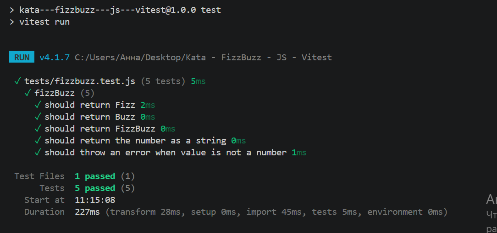

# FizzBuzz Kata

## Description

This project implements the FizzBuzz kata.

Rules:

- If a number is divisible by 3, return `Fizz`.
- If a number is divisible by 5, return `Buzz`.
- If a number is divisible by both 3 and 5, return `FizzBuzz`.
- If a number is not divisible by 3 or 5, return the number as a string.
- If the provided value is not a number, throw an error.

## Project Structure

```text
.
├── src/fizzbuzz/fizzbuzz.js
├── tests/fizzbuzz.test.js
├── main.js
├── package.json
└── README.md
```

## Installation

```bash
npm install
```
## Run tests

```bash
npm test
```
## Test screenshot


